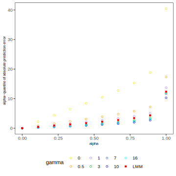

# causalLMM
This repository contains the code to reproduce the results from the second part of my master thesis. This is an extension of [Anchor Regression](https://academic.oup.com/jrsssb/article/83/2/215/7056043) to linear mixed-effects models. The `causalLMM` estimator protects against distribution shifts in the fixed-effects and hidden variables up to a certain size. 

## Reproducing experiments

To reproduce the empirical analysis done in the thesis, run in the terminal: 

```
Rscript sims/simulations.R
```

This will reproduce all experiments. In particular, the following analysis' will be done: 

- Comparison of moderate vs. strong shifts 
- Comparison of different values of `gamma`
- Analyse behaviour under model missspecifications, i.e. see what happens if also the random effects are influenced by shifts

Note that `gamma` is the causal regularization parameter. It determines how "causal" our solution should be. See the thesis for more details. 

You can access the created figures in fig/. For example, the effect of `gamma`on the absolute prediction error is:

<p align="center">  
    
</p>  

## Additional information

Although the code does not come in a nice R-package, it is written as if it was in one. If at any point in the future, somebody decides to create a R-package, it should be possible.

## Feedback

Constructive feedback is more than welcome. Do not hesitate to reach me at [email](mailto:schwarbf@student.ethz.ch).
